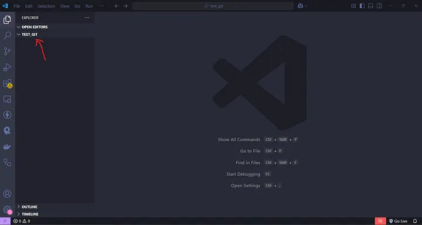

Name: Raphael Harloverin Gunarso 

NIM: 2902641824 

Class: B4CC

Article: https://blog.devgenius.io/git-branch-and-git-merge-best-practices-for-git-basics-876a035fc7a7

In this article, I will show you how to use Git to clone and remote a GitHub repository from your local machine. We will also apply Git branching and merging to the repository we have created.

In general (not everyone), most people when learn git basics still do not fully understand how to implement Git branching and merging in a GitHub repository. As a result, some may feel less confident when creating a new branch in a repository and then merging it.

Hopefully, through this article, you will gain a better understanding of how to apply or use Git branching and merging in a GitHub repository.

Prerequisite

    Github Account. You must have a github account in github website (https://github.com/). Please register a new github account if you don’t have the github account.
    Git Command. You must download and install git in your local machine/laptop. For Downloading the git, please refer to this link: https://git-scm.com/downloads
    Code Editor (Visual Studio Code). If you don’t have Visual studio code or code editor in your local machine/computer. Please download and install the code editor app. (https://code.visualstudio.com/download)

In this article, you will learn about:

    How to Create and Remote the Github Repository From Local Machine.
    How to implementing Branches Using Git Branch and Git Merge.

Step 1 — Create folder and file in your local machine/computer

Create a new folder in your local machine/computer named “test_git” (for an example). We will use that folder as a working directory to remote our repository in github.

Open your code editor (Ex: Visual Studio Code, etc). After that, open the folder that you have prepared earlier in the Visual Studio Code (VS Code), then click on the “File” menu -> “Open Folder”, and select the folder you previously created on your computer. Or, you can also drag and drop the folder directly into VS Code, and the folder will be open.

If the folder (test_git) is already open in VS Code, the display will look like the image below.

As you can see, the red arrow indicates the name of the active folder currently open in VS Code.

Next, create a new file with Markdown (.md) format in that folder (test_git folder) named “README.md” (for an example). In this tutorial, I will populate the README.md file with an article titled “Indonesia Country”, which I sourced from Wikipedia. Of course, you can fill the README.md file with any content you like. After that, don’t forget to save the file (Ctrl + S). For more details about the Markdown (.md) format, you can learn through the following link: https://www.markdownguide.org/basic-syntax/

    A README.md file is a Markdown file commonly used in projects to provide important information about the project. It usually includes an introduction, installation instructions, usage guidelines, and other relevant details. The “.md” extension indicates that it uses Markdown formatting, allowing for easy styling like headings, lists, links, and code snippets.

    In repositories (e.g., GitHub, GitLab), the README.md file is automatically displayed on the main page to help users understand the project quickly.

Open the terminal in VS Code (Terminal -> New terminal). The terminal will then appear inside VS Code. Since my computer runs Windows Operating system, the default terminal is PowerShell. However, you can change it to your preferred terminal based on your needs.

Step 2 — Create a repository (repo) on github website

First, you can open the github website (https://www.github.com) and sign in with your github account. After that, you can click + icon in the top-right corner of the github website page, then select “New repository”. (check the image below).

After selecting “New Repository”, you will be directed to the “Create a New Repository” page. You can fill in the details as shown in the image, then click “Create Repository” to create the repository.

    Owner: indicates who owns the repository.

    Slash ( / ): used to separate the repository name from the owner.

    Repository name: filled with the name of your repository or project in the provided field. (Ex: learn_git_branch)

    Description: contains a description of the repository being created. This field is optional — you may fill it in or leave it blank.

After that, Congratulations! You will be directed to the GitHub repository page (check the image below), where you will find information for remotely accessing the repository. Next, we will remote the repository to the local machine/computer.

Step 3 — Remote the github repository from local machine using git command

Focus on the terminal in VS Code. Type and follow the Git commands below to remotely connect to the repository.

    First, type “git init” and press enter to Initialize a new Git repository (repo) in the current directory.

The git init command actually creates a hidden folder named .git inside the "test_git" folder (the active directory). Do not delete this folder, as it allows Git to track and record every change you make within the repository being managed remotely.

    Next, type “git add .” And press enter to add a new file to the staging area. Dot (.) symbol means you add all modified and new files to the staging area.

    Next, type “git commit –s –m “first commit”” and press enter.

    git commit → Creates a new commit (a snapshot of changes) in the Git repository.

    -s (Sign-off) → Adds a “Signed-off-by” line at the end of the commit message. This is often used in projects that require developers to certify that they agree to the project’s contribution guidelines.

    -m “first commit” → Specifies the commit message directly. In this case, the message is “first commit” (for an example), indicating the first saved change in the repository.

    After create a commit, because this is your first commit, you must type git remote add origin https://github.com/Juwono136/learn_git_branch.git and press enter. The URL link https://github.com/Juwono136/learn_git_branch.git, you can get it from the repo on github web, or you can go to “Code” menu and in HTTPS tab, copy the URL link.

    The git remote add origin <github url link> command is only executed when the repository is first created. Its to allow the folder being tracked on the local machine to recognize and connect to the GitHub repository.

    Then, you must type “git push –u origin master” and press enter to push your file from your local machine to the github repository. Master is a branch name. You must know the branch name according to active branch.

    To check the name of the currently active branch, you can type git branch in the terminal. If you see a * symbol next to a branch name, it means that branch is currently active. Also, you can type git status in the terminal, you can check the current status of the repo.

    To see the result, go back to your GitHub repository page, refresh the page, and you will see the README.md file, identical to the one on your local machine/computer. Congratulations! You have successfully connected and pushed your local repository to GitHub.

In this case, we will try to implement multiple branches in the previously created GitHub repository (learn_git_branch repo) using Git Branch and Git Merge. At least, we will create a branch structure similar to the image below:

Based on the image, we can see that there are 4 branches:

    Master/Main Branch — The primary branch (common base branch).
    Fixed Branch
    Experiment Branch
    Test Branch

The Master/Main branch has 5 commits (dots), the fixed branch has 2 commits, the experiment branch has 4 commits, and the Test Branch has 2 commits. Which is the fixed and experiment branches are created from the Master/Main Branch, while the test branch is created from the experiment branch.

How do we create it? Let’s get started!

Step 1 — Create new commits for master/main branch

Before starting to create commits for the main/master branch, the image below shows the last update of README.md file we are successfully created and pushed to the GitHub repository (learn_git_branch). And remember, we also created 1 commit for the README.md file when we first pushed it to the GitHub repository.

Actually, we can view the commit history of a repository using git log --oneline. However, if you want to see the commit history in a graphical format (Network graph), you can check it in your GitHub repository by navigating to Insights -> Network.

The commit timeline will appear as shown in the image below.

Now, let’s go back to the branch structure we want to create. First, we need to make 2 commits for the master branch.

Why not create all 5 commits directly in the master branch? It’s important to note that the third commit in the master branch is actually created from merging the experiment branch into the master branch.

Therefore, commits must be made in parallel across different branches. When you perform a git merge, a new commit is automatically created as part of the merging process.

Okay, now you are starting to understand the meaning of the image. It’s time to create 1 more commit for the master branch, so the total commits in the master branch will be 2 (two).

You can use the following Git command to create a new commit:

    Edit the README.md file, adding some text to the article. For example, I will add general information about Indonesia. Then, save the file.
    In the terminal, type git add . to add all file changes to the staging area.
    Next, type git commit -s -m "add indonesia desc" to save a record/snapshot of the changes.
    Finally, type git push origin master to upload the changes from the staging area to the remote repository.

And, Congratulations again! You successfully created a new commit for master branch. Now, you can refresh the github repository website page and see in the Network graph, the total commits in master branch is 2.

Please ignore the numbers 12 and 13 above the commit timeline. Those numbers actually represent the dates when the commits were made.

Next, we should not create the third commit in the master branch yet. First, we need to create a new branch named experiment branch, which will have 3 commits (based on the image).
Get Juwono (ジュウｵノ)’s stories in your inbox

Join Medium for free to get updates from this writer.

After that, we will merge the experiment branch into the master branch, which will automatically create a new commit (third commit) in the master branch.

Step 2 — Create new branch called “experiment branch” and also create new commits for experiment branch

First, we can check which branch we are currently on by using git branch. This command will display a list of all branches in the repository and indicate the active branch with a * symbol. As you can see, now the active branch is master.

To create a new branch, we can use the command: git branch <branch-name> . However, we want to create the experiment branch starting from the first commit of the master branch. How can we do that?

To do this, we can use the command:git checkout -b <branch-name> <commit code> . What is a commit code? A commit code is a unique identifier (random code) generated by Git to distinguish one commit from another. To view commit code, use: git log --oneline and press enter.

As you can see, the first commit code is 4298429.

Now that we know the commit code, type in terminal:

git checkout -b experiment 4298429 and press Enter.

Now, the new branch called experiment has been made successfully and also in the same time, the active branch now is experiment branch. Now, same as master branch, we must create 3 commits for the experiment branch before finally merging it into the master branch. The fourth commit in the experiment branch will come from merging the test branch (which we will create later) into the experiment branch.

Use the following Git command to create a new commit (Repeat this following steps 3 times to create 3 commits (with different commit messages) in the experiment branch):

    Edit the README.md file, adding or update with some text to the article. Then, save the file.
    git add .
    git commit -s -m "add etymology desc"
    git push origin experiment

After successfully making 3 commits in the experiment branch, the Network graph in github repo will look like the following.

All right! Next, We will create a new branch called test branch. This branch will have 2 commits, which will be merged to create the fourth commit in the experiment branch.

Step 3 — Create new branch called “test branch” and also create new commits for test branch

First, just like when creating the experiment branch, we need to determine which commit the test branch should be created from. Use the following command to check the commit code in experiment branch:

git log --oneline

According to the image above, we know the first commit of experiment branch is “add etymology desc”. Once you find the correct commit code (ec17a59), create the test branch using the following command:

git checkout -b test ec17a59

Then, create 2 commits for the test branch, using the same method as when you created commits for the experiment branch. Remember, you must type “git push origin test” because you want to push to test branch (not experiment branch). Once finished, the Network graph will loke like this following.

Now, the Network graph may look a bit messy because we created the test branch from the experiment branch.

This is completely normal — no need to worry! The graph will become organized again after we merge the branches.

Congratulations! Up to this step, you have successfully created 3 branches (master, experiment, and test) along with their respective commits. Next, we will merge the test branch into the experiment branch.

Step 4 — Merging test branch into experiment branch

Merging is easier than creating a branch, but it must be done carefully. To merge the test branch (children branch) into the experiment branch (parent branch), you need to switch the active branch to experiment branch.

To switch branches, use the following command:

git checkout experiment and press Enter.

Now, the active branch changes from test branch to experiment branch

Next, after switching to the experiment branch, to perform the merge, simply type:

git merge test

After that, a notification will appear in the README.md file in VS Code, indicating a merge conflict, with a message similar to the following:

Don’t worry! We will resolve this merge conflict by checking the available options marked with a red circle. The options are:

    Accept Current Change = Keeps the changes from the current branch and discards the incoming changes from the branch being merged.
    Accept Incoming Change = Keeps the changes from the branch being merged and discards the current branch’s changes.
    Accept Both Changes = Combines both changes from the current branch and the incoming branch.
    Compare Changes = Shows the differences between both versions side by side.

You can choose any option based on your needs.

In this example, I will select “Accept Both Changes”, and voilà! The merge conflict is successfully resolved.

After merge conflict is resolved, you can using the same method to save the changes as when you created commits for the experiment branch and test branch. As I mention before, when you merge the branches, its mean a new commit will create.

If you go back to the Network graph page in your GitHub repository, you will see that the network graph has now changed. The test branch has successfully been merged into the experiment branch, as shown in the image below.

Mission half complete 😂! Next, we will merge the experiment branch into the master branch.

Step 5 — Merging experiment branch into master branch

Just like merging the test branch into the experiment branch, we can do the same to merge the experiment branch into the master branch. Remember, before merging, make sure the active branch is set to master.

Then, use the following command to perform the merge:

git merge experiment

Once the merge is successful, you can go back to the Network graph. Now, the network graph will look like the following after the merging process.

Now, your task is to create a new branch called fixed branch, based on the image. I’m confident that you can do this! 💪 Try following the same steps we used to create the master, experiment, and test branches. Good luck!

Once successful, the network graph will look like the following.

Okay, now you can see that the Network graph closely matches the branch scheme image we created earlier.

Congratulations! You have successfully implemented Git branching and merging in your GitHub repository.
